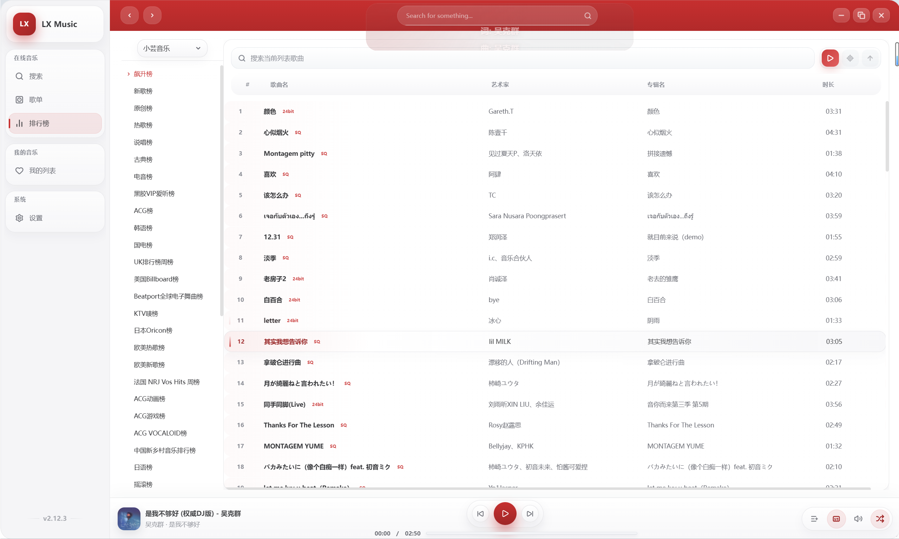
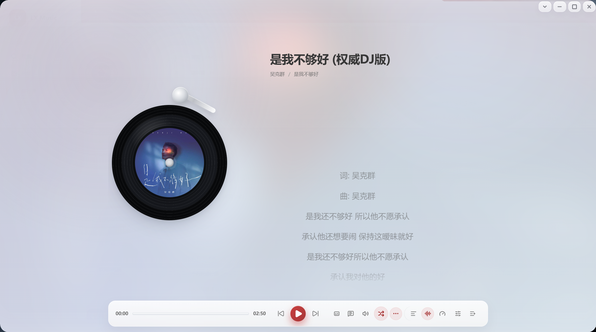

<h1 align="center">LX Music 桌面版 UI 修改版</h1>

基于 <a href="https://github.com/lyswhut/lx-music-desktop">LX Music Desktop</a> 的二次 UI 修改版本

## 源项目

源项目：<https://github.com/lyswhut/lx-music-desktop>

本仓库在原项目基础上做了 UI、交互与部分客户端播放链路的二次修改，不代表 LX Music Desktop 官方版本。

## 二次修改说明

- 重新优化主界面、左侧菜单、顶部窗口按钮、底部播放栏与播放详情页视觉。
- 优化底部播放栏与播放详情页的封面加载动画、播放按钮加载态、歌词/评论区/底部控制区样式，并同步坏源找歌时的加载反馈。
- 优化全屏 / 最大化 / 还原状态，以及播放详情页双击关闭、拖动窗口等操作体验。
- 优化设置页图标、弹窗、版本信息、下拉层宽度/对齐与主题适配，减少白底突兀、图标错位和悬浮样式互搓。
- 新增窗口尺寸“全屏”、详情页“更多”默认展开、一键播放当前歌单、在线 JSON 一键订阅等 UI 操作。
- 为“我的列表”、排行榜、歌单内子歌曲列表补充搜索栏工具区，支持搜索当前列表、一键播放筛选结果、定位当前播放歌曲与回到顶部。
- 调整歌单 / 排行榜相关布局细节，包括来源标签对齐、按钮同排排布、歌单信息图标与播放量换行展示等细节。
- 重做“自定义源”管理弹窗，补充本地 / 订阅分类、搜索筛选、批量选择、导出压缩包、重新订阅、导入 / 在线订阅加载态等交互。
- 补充自定义源弹窗的横向分类栏、底部文档操作区、源编码说明 / FAQ / 严格实播说明入口，以及关闭弹窗时联动结束测试任务。
- 新增自定义源“严格实播测试”，支持单个测试、批量 5 窗并发测试、停止测试、删除源时自动取消测试，并复用统一的实播校验逻辑。

- 默认隐藏软件更新入口，避免二次修改版本误触发源项目更新逻辑。

> 在线音乐播放需要用户自行导入可用的自定义 API；本仓库不内置任何音乐 API。

## UI 展示

## 项目协议

本项目基于 [Apache License 2.0](https://github.com/lyswhut/lx-music-desktop/blob/master/LICENSE) 许可证发行，以下协议是对于 Apache License 2.0 的补充，如有冲突，以以下协议为准。

---

*词语约定：本协议中的“本项目”指 LX Music（洛雪音乐助手）桌面版项目；“使用者”指签署本协议的使用者；“官方音乐平台”指对本项目内置的包括酷我、酷狗、咪咕等音乐源的官方平台统称；“版权数据”指包括但不限于图像、音频、名字等在内的他人拥有所属版权的数据。*

### 一、数据来源

1.1 本项目的各官方平台在线数据来源原理是从其公开服务器中拉取数据（与未登录状态在官方平台 APP 获取的数据相同），经过对数据简单地筛选与合并后进行展示，因此本项目不对数据的合法性、准确性负责。

1.2 本项目本身没有获取某个音频数据的能力，本项目使用的在线音频数据来源来自软件设置内“自定义源”设置所选择的“源”返回的在线链接。例如播放某首歌，本项目所做的只是将希望播放的歌曲名、艺术家等信息传递给“源”，若“源”返回了一个链接，则本项目将认为这就是该歌曲的音频数据而进行使用，至于这是不是正确的音频数据本项目无法校验其准确性，所以使用本项目的过程中可能会出现希望播放的音频与实际播放的音频不对应或者无法播放的问题。

1.3 本项目的非官方平台数据（例如“我的列表”内列表）来自使用者本地系统或者使用者连接的同步服务，本项目不对这些数据的合法性、准确性负责。

### 二、版权数据

2.1 使用本项目的过程中可能会产生版权数据。对于这些版权数据，本项目不拥有它们的所有权。为了避免侵权，使用者务必在 **24 小时内** 清除使用本项目的过程中所产生的版权数据。

### 三、音乐平台别名

3.1 本项目内的官方音乐平台别名为本项目内对官方音乐平台的一个称呼，不包含恶意。如果官方音乐平台觉得不妥，可联系本项目更改或移除。

### 四、资源使用

4.1 本项目内使用的部分包括但不限于字体、图片等资源来源于互联网。如果出现侵权可联系本项目移除。

### 五、免责声明

5.1 由于使用本项目产生的包括由于本协议或由于使用或无法使用本项目而引起的任何性质的任何直接、间接、特殊、偶然或结果性损害（包括但不限于因商誉损失、停工、计算机故障或故障引起的损害赔偿，或任何及所有其他商业损害或损失）由使用者负责。

### 六、使用限制

6.1 本项目完全免费，且开源发布于 GitHub 面向全世界人用作对技术的学习交流。本项目不对项目内的技术可能存在违反当地法律法规的行为作保证。

6.2 **禁止在违反当地法律法规的情况下使用本项目。** 对于使用者在明知或不知当地法律法规不允许的情况下使用本项目所造成的任何违法违规行为由使用者承担，本项目不承担由此造成的任何直接、间接、特殊、偶然或结果性责任。

### 七、版权保护

7.1 音乐平台不易，请尊重版权，支持正版。

### 八、非商业性质

8.1 本项目仅用于对技术可行性的探索及研究，不接受任何商业（包括但不限于广告等）合作及捐赠。

### 九、接受协议

9.1 若你使用了本项目，即代表你接受本协议。

---

若对此有疑问请 mail to: lyswhut+qq.com (请将 `+` 替换为 `@`)
